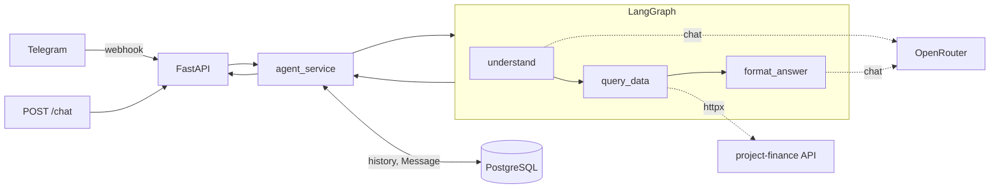

# 🤖 Finance Agent

[](https://github.com/daniil-avdeenko/FastApi-Finance-Agent/actions/workflows/ci.yml)
[](https://github.com/daniil-avdeenko/FastApi-Finance-Agent/releases)
[](https://www.python.org/downloads/)
[](LICENSE)

Telegram AI-агент для системы [project-finance](https://github.com/daniil-avdeenko/project-finance).
Отвечает на вопросы о проектах и финансах на естественном языке.

Агент не ходит в БД основного проекта напрямую — только через публичный
REST API `/api/v1/*`. Развязка сервисов, отказ от shared-credentials,
независимый деплой.

## Архитектура



**Поток запроса.** `FastAPI` принимает запрос от Telegram (webhook) или
напрямую через `POST /chat`, и передаёт его в `agent_service`. Сервис
читает историю последних 5 сообщений по `chat_id` из PostgreSQL и
запускает LangGraph-граф.

`understand` вызывает LLM (OpenRouter) и классифицирует вопрос в
`intent` + `params`. `query_data` по этому intent вызывает нужный tool —
HTTP-запрос к публичному API основного проекта через httpx.
`format_answer` вторым вызовом LLM превращает JSON в человеческий текст.
Исключение — списки транзакций: их рендерит Python-форматтер.

Узлы не роняют граф при ошибках: сетевые сбои, 4xx/5xx, падение LLM
пишутся в `state.error` и попадают в ответ пользователю как понятный текст.

**Контекст диалога.** Граф stateless: каждый вопрос независим. Последние
5 сообщений по `chat_id` подкладываются в промпт `understand` — это
позволяет LLM правильно обработать уточняющие сообщения пользователя,
ссылающиеся на контекст предыдущих сообщений.

## Возможности

| Интент | Пример вопроса                                 |
|---|------------------------------------------------|
| `summary` | Сводка по финансам за август                   |
| `projects` | Список проектов                                |
| `project_detail` | Детали проекта 2                               |
| `transactions` | Перечисли транзакции по проекту 1 за август    |
| `aggregate` | Суммарный доход за июль                        |
| `profit` | Прибыль по проектам за май                     |
| `count` | Сколько транзакций было в августе по проекту 4 |
| `currencies` | Курсы валют                                    |


**Форматирование ответов.** Списки транзакций рендерятся в Python, а не
LLM: на плоских повторяющихся данных модель путает поля соседних записей.
Числа форматируются единообразно — разделители тысяч, `₽`, проценты с
двумя знаками, формат дат `DD.MM.YYYY`.

## Стек

| Слой | Технологии |
|---|---|
| HTTP | FastAPI, uvicorn, Pydantic v2 |
| Агент | LangGraph, LangChain, OpenRouter (OpenAI SDK) |
| Telegram | aiogram 3 (webhook + polling) |
| БД | PostgreSQL 16, SQLAlchemy 2.0 async, asyncpg, Alembic |
| HTTP-клиент | httpx |
| Тесты | pytest, pytest-asyncio, testcontainers, respx |
| Качество | ruff, mypy (strict), pre-commit, gitleaks |
| CI/CD | GitHub Actions: tests + lint, авто-деплой на Railway |
| Деплой | Docker, Railway |

## Что реализовано

**Агент.**
- LangGraph-граф с тремя узлами, `lru_cache` на компиляцию.
- `LLMProvider` (Protocol) с двумя реализациями: `MockLLM` для тестов
  и `OpenRouterLLM` поверх `openai.AsyncOpenAI`.
- Обработка ошибок LLM и tools: не роняют граф, пишутся в `state.error`.
- Постобработка чисел и дат перед отправкой пользователю.

**Публичный API.**
- `POST /chat` — принимает `{chat_id, question}`, гоняет граф, сохраняет
  `Message`, возвращает `{answer, llm_provider, latency_ms}`.
- `POST /telegram/webhook` — приём апдейтов с проверкой secret token.
- `/health` — healthcheck для Railway и Docker.

**Telegram-бот.**
- aiogram 3: dispatcher, handlers, FSM storage.
- Rate limit middleware: скользящее окно на `user_id` (10 запросов/мин).
- Webhook для прода, polling runner для локальной разработки. Runner
  снимает активный webhook перед polling — иначе `409 Conflict`.

**История диалогов.**
- `Message` (chat_id, question, answer, intent, params, llm_provider,
  latency_ms, created_at) в PostgreSQL.
- `intent` + `params` хранятся для контекста — на их основе строится
  промпт следующего вопроса.

**Безопасность.**
- Проверка `X-Telegram-Bot-Api-Secret-Token` на webhook.
- Валидация конфига на старте: `openrouter` без ключа не поднимается.
- Санитизация ошибок API: без URL и технических деталей в ответе.
- gitleaks в pre-commit, секреты только в env.

**CI/CD.**
- GitHub Actions: два джоба (`Tests`, `Lint & Type Check`).
- Branch protection на main: PR обязателен, статус-чеки зелёные.
- Auto-deploy на Railway после мержа в main.
- Lock-файлы собираются `pip-tools` в Linux-контейнере: версии pip-tools и Python зафиксированы,
чтобы локальная сборка совпадала с CI.

## Быстрый старт

```bash
git clone https://github.com/daniil-avdeenko/FastApi-Finance-Agent.git
cd FastApi-Finance-Agent

python -m venv .venv
.venv\Scripts\activate                    # Windows
pip install -r requirements-dev.txt

docker compose up -d                      # Postgres + Adminer
cp .env.example .env                      # заполнить TELEGRAM_BOT_TOKEN и LLM_API_KEY
alembic upgrade head
uvicorn app.main:app --reload
```

- Healthcheck: http://127.0.0.1:8000/health
- Swagger (dev): http://127.0.0.1:8000/docs

### Telegram-бот

**Webhook (прод).** Необходимо установить:

```dotenv
TELEGRAM_MODE=webhook
TELEGRAM_WEBHOOK_URL=https://<домен>/telegram/webhook
```
Бот сам вызывает `set_webhook` при старте сервиса.

**Polling (локально).** Публичного HTTPS нет, поэтому бот сам опрашивает
Telegram:

```dotenv
TELEGRAM_MODE=polling
TELEGRAM_BOT_TOKEN=...
```

```bash
python -m app.telegram.runner
```

## Деплой на Railway

Два сервиса:

1. **PostgreSQL** — managed, `DATABASE_URL` подставляется в web через
   reference variable.
2. **web** — Dockerfile, публичный HTTPS. Обслуживает и HTTP API,
   и Telegram-бот через webhook.

Миграции запускаются в `CMD` Dockerfile: `alembic upgrade head && exec uvicorn ...`.

`railway.toml`: `builder = "DOCKERFILE"`, `healthcheckPath = "/health"`.

Переменные для web:

```dotenv
APP_ENV=production
SECRET_KEY=<random>
DATABASE_URL=${{Postgres.DATABASE_URL}}
MAIN_API_URL=https://project-finance-production-21.up.railway.app
LLM_PROVIDER=openrouter
LLM_API_KEY=sk-or-v1-...
LLM_MODEL=google/gemini-3.1-flash-lite
TELEGRAM_MODE=webhook
TELEGRAM_BOT_TOKEN=...
TELEGRAM_WEBHOOK_URL=https://<домен>/telegram/webhook
TELEGRAM_WEBHOOK_SECRET=<random>
TELEGRAM_RATE_LIMIT=10
TELEGRAM_RATE_WINDOW=60
```

## Тесты

```bash
pytest                                    # coverage ≥ 90%
ruff check app/ tests/
ruff format --check app/ tests/
mypy app/
```

- **Unit** — LLM-провайдеры, tools (respx), узлы графа, сборка графа,
  aiogram-хендлеры, throttling, форматтеры чисел и дат.
- **Integration** — `POST /chat`, `/telegram/webhook`, `agent_service`,
  модель `Message` на реальном Postgres через testcontainers.
- **Failure paths** — LLM недоступен, API недоступен, мусор от LLM
  вместо JSON, rate limit, отсутствующий секрет webhook.

## Структура

```
app/
├── agent/            # LangGraph: state, nodes, tools, graph, LLM-провайдеры
├── api/              # FastAPI: /chat, /telegram/webhook
├── telegram/         # aiogram: bot, handlers, middlewares, runner
├── models/           # SQLAlchemy: Message
├── services/         # agent_service
├── config.py         # pydantic-settings
├── db.py             # engine, session factory
└── main.py           # FastAPI app + lifespan
migrations/           # Alembic
tests/unit/           # быстрые, без БД
tests/integration/    # с реальным Postgres
scripts/              # pip-compile в Linux-контейнере
```

## Управление зависимостями

Lock-файлы (`requirements*.txt`) собираются `pip-tools` **внутри
Linux-контейнера**. Версия `pip-tools` и Python зафиксированы в
[`scripts/requirements-compile.Dockerfile`](scripts/requirements-compile.Dockerfile).

```bash
./scripts/compile-requirements.sh      # Linux / macOS / Git Bash
.\scripts\compile-requirements.ps1     # Windows PowerShell
```

## Лицензия

MIT
